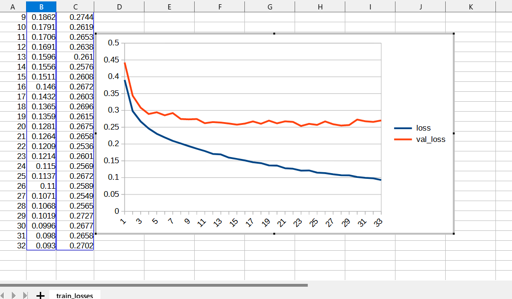

# Image-Segmentation-Ovarian-Tumor (2023/07/28)
<h2>
1 Image-Segmentation-Ovarian-Tumor 
</h2>

This is an experimental project for Image-Segmentation of Ovarian-Tumor by using
 <a href="https://github.com/atlan-antillia/Tensorflow-Slightly-Flexible-UNet">Tensorflow-Slightly-Flexible-UNet</a> Model,
which is a typical classic Tensorflow2 UNet implementation <a href="./TensorflowUNet.py">TensorflowUNet.py</a> 

The original image dataset <b>OTU_2d</b> used here has been taken from the following google drive.

<a href="https://drive.google.com/drive/folders/1c5n0fVKrM9-SZE1kacTXPt1pt844iAs1?usp=sharing">MMOTU</a>
 
 
Please see also: 
<pre>
MMOTU_DS2Net
https://github.com/cv516Buaa/MMOTU_DS2Net
</pre>
<pre>
Dataset
Multi-Modality Ovarian Tumor Ultrasound (MMOTU) image dataset consists of two sub-sets with two modalities, 
which are OTU_2d and OTU_CEUS respectively including 1469 2d ultrasound images and 170 CEUS images. 
On both of these two sub-sets, we provide pixel-wise semantic annotations and global-wise category annotations. 
Many thanks to Department of Gynecology and Obstetrics, Beijing Shijitan Hospital, 
Capital Medical University and their excellent works on collecting and annotating the data.

MMOTU : google drive (move OTU_2d and OTU_3d to data folder. Here, OTU_3d folder indicates OTU_CEUS in paper.)
</pre>

 
<h2>
2. Install Image-Segmentation-Ovarian-Tumor 
</h2>
Please clone Image-Segmentation-Ovarian-Tumor.git in a folder <b>c:\google</b>. 
<pre>
>git clone https://github.com/sarah-antillia/Image-Segmentation-Ovarian-Tumor.git 
</pre>
You can see the following folder structure in your working folder. 

<pre>
./Image-Segmentation-Ovarian-Tumor 
├─asset
└─projects
    └─Ovarian-Tumor
        ├─eval
        ├─generator
        ├─models
        ├─Ovarian-Tumor
        │  ├─test
        │  │  ├─images
        │  │  └─masks
        │  ├─train
        │  │  ├─images
        │  │  └─masks
        │  └─valid
        │      ├─images
        │      └─masks
        ├─test_output
        └─test_output_merged
</pre>

<h2>
3 Prepare dataset
</h2>

<h3>
3.1 Download master dataset
</h3>
  Please download the original image and mask dataset OTU_2d.zip from the following google drive 
<a href="https://drive.google.com/drive/folders/1c5n0fVKrM9-SZE1kacTXPt1pt844iAs1?usp=sharing">MMOTU</a>

The dataset <b>OTU_2d</b> has the following folder structure. 
<pre>
./OTU_2d
├─annotations
└─images
</pre>
<h3>
3.2 Create image and mask dataset
</h3>
By using Python script <a href="./projects/Ovarian-Tumor/generator/ImageMaskDatasetGenerator.py">ImageMaskDatasetGenerator.py</a>,
 we have created <b>Ovarian-Tumor-master</b> dataset from the original annotations and images files. 
The script performs the following image processings. 
<pre>
1 Create square images from the original JPG files in images folder

2 Create square masks corresponding to those images from PNG files in annotations folder.

3 Create rotated and flipped images and masks of size 256x256 to augment the resized square images and masks.
</pre>

The created <b>Ovarian-Tumor-master</b> dataset has the following folder structure. 
<pre>
./Ovarian-Tumor-master
├─images
└─masks
</pre>

<h3>
3.3 Split Ovarian-Tumor-master to test, train and valid 
</h3>
By using Python script <a href="./projects/Ovarian-Tumor/generator/split_master.py">split_master.py</a>,
 we have finally created <b>Ovarian-Tumor</b> dataset from the Ovarian-Tumor-master. 
<pre>
./Ovarian-Tumor
  ├─test
  │  ├─images
  │  └─masks
  ├─train
  │  ├─images
  │  └─masks
  └─valid
      ├─images
      └─masks
</pre>
<b>train/images samples:</b> 

 
<b>train/masks samples:</b> 

 

<h2>
4 Train TensorflowUNet Model
</h2>
 We have trained Ovarian-Tumor TensorflowUNet Model by using the following
 <b>train_eval_infer.config</b> file.  
Please move to ./projects/Ovarian-Tumor directory, and run the following bat file. 
<pre>
>1.train.bat
</pre>
, which simply runs the following command. 
<pre>
>python ../../TensorflowUNetTrainer.py ./train_eval_infer.config
</pre>
, where train_eval_infer.config is the following.
<pre>
; train_eval_infer.config
; Dataset of Ovarian-Tumor
; 2023/07/28 antillia.com

[model]
image_width    = 256
image_height   = 256

image_channels = 3
num_classes    = 1
base_filters   = 16
base_kernels   = (5,5)
num_layers     = 7
dropout_rate   = 0.07
learning_rate  = 0.0001
clipvalue      = 0.3
dilation       = (1,1)
loss           = "bce_iou_loss"
metrics        = ["iou_coef"]
show_summary   = False

[train]
epochs        = 100
batch_size    = 4
patience      = 10
metrics       = ["iou_coef", "val_iou_coef"]
model_dir     = "./models"
eval_dir      = "./eval"
image_datapath = "./Ovarian-Tumor/train/images"
mask_datapath  = "./Ovarian-Tumor/train/masks"
create_backup  = True

[eval]
image_datapath = "./Ovarian-Tumor/valid/images"
mask_datapath  = "./Ovarian-Tumor/valid/masks"
output_dir     = "./eval_output"

[infer] 
;images_dir = "./mini_test/"
images_dir = "./Ovarian-Tumor/test/images"
output_dir = "./test_output"
merged_dir = "./test_output_merged"

[mask]
blur      = True
binarize  = True
threshold = 74

</pre>

The training process has just been stopped at epoch 33 by an early-stopping callback as shown below.  
 
 
 
<b>Train metrics line graph</b>: 
 
 
<b>Train losses line graph</b>: 
 

<h2>
5 Evaluation
</h2>
 We have evaluated prediction accuracy of our Pretrained Ovarian-Tumor Model by using <b>valid</b> dataset. 
Please move to ./projects/Ovarian-Tumor/ directory, and run the following bat file. 
<pre>
>2.evalute.bat
</pre>
, which simply runs the following command. 
<pre>
>python ../../TensorflowUNetEvaluator.py ./train_eval_infer.config
</pre>
The evaluation result is the following. 
 
 

<h2>
6 Inference 
</h2>
We have also tried to infer the segmented region for 
<pre>
images_dir    = "./Ovarian-Tumor/severe_dysplastic/test/images" 
</pre> dataset defined in <b>train_eval_infer.config</b>,
 by using our Pretrained Ovarian-Tumor UNet Model. 
Please move to ./projects/Ovarian-Tumor/ directory, and run the following bat file. 
<pre>
>3.infer.bat
</pre>
, which simply runs the following command. 
<pre>
>python ../../TensorflowUNetInferencer.py ./train_eval_infer.config
</pre>

<b><a href="./projects/Ovarian-Tumor/Ovarian-Tumor/test/images">Test input images</a> </b> 
 
 
<b><a href="./projects/Ovarian-Tumor/Ovarian-Tumor/test/masks">Test input ground truth mask</a> </b> 
 
 

<b><a href="./projects/Ovarian-Tumor/test_output/">Inferred images </a>test output</b> 
 
 
 

<b><a href="./projects/Ovarian-Tumor/test_output_merged">Inferred merged images (blended test/images with 
inferred images)</a></b> 
  

 
<!--
-->

 

<h3>
References
</h3>
<b>1. A Multi-Modality Ovarian Tumor Ultrasound Image Dataset for Unsupervised Cross-Domain Semantic Segmentation</b> 
Qi Zhao, Shuchang Lyu, Wenpei Bai, Linghan Cai, Binghao Liu, Meijing Wu, Xiubo Sang, Min Yang, Lijiang Chen 
<pre>
https://arxiv.org/abs/2207.06799
</pre>

<b>2. MMOTU_DS2Net</b> 
<pre>
https://github.com/cv516Buaa/MMOTU_DS2Net
</pre>
